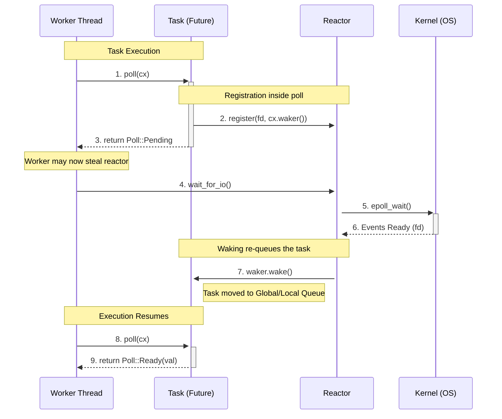

## Introduction to Asynchronous Programming
In synchronous programming, tasks execute linearly one after another on a single thread. 
```rust
fn synchronous() {
	println!("1st");
	println!("2nd");
	println!("3rd");
}
```

For many situations this works great, but if a single task in the chain is slow the entire program halts as we wait for it to finish. This is called "blocking" the thread. 
```rust
use std::time::Duration::from_secs;
use std::thread::sleep;

fn synchronous_blocking() {
	println!("1st");
	sleep(from_secs(3)); // this blocks for 3 seconds
	println!("2nd");
	println!("3rd");
}
```

Asynchronous programming allows tasks to yield control while waiting for blocking operations, ensuring that one slow task doesn't halt the entire program's progress. There are two main strategies commonly grouped together under the umbrella of asynchronous programming: *concurrency* and *parallelism*. 

Concurrency is like starting on dinner after putting a load of laundry in. Concurrency is about interleaving tasks to manage multiple starts and stops. This can happen on a single thread. 


[Diagram Credit: The Rust Programming Language, Chapter 17](https://doc.rust-lang.org/book/ch17-00-async-await.html)

Parallelism is like having one person on dinner and another on laundry. Parallelism is about executing tasks simultaneously across multiple threads.

[Diagram Credit: The Rust Programming Language, Chapter 17](https://doc.rust-lang.org/book/ch17-00-async-await.html)

This piece will focus specially on leveraging concurrency in async Rust for blocking I/O and the multithreaded. If you want to learn more about parallelism for CPU-bound workloads take a look at [rayon](https://github.com/rayon-rs/rayon).
## Introduction to Async Rust
Most modern programming languages like Go and JavaScript come with an ergonomic async runtime built into the language that allows you to easily complete tasks concurrently. 
```javascript
async function task(id) {
  // fetch starts immediately when this function is called
  const resp = await fetch(`https://dummyjson.com/todos/${id}`);
  return await resp.json();
}

async function main() {
  const ids = Array.from({ length: 10 }, (_, i) => i + 1);
  
  // These start executing immediately upon mapping
  const promises = ids.map(id => task(id));

  // Wait for all to finish
  const results = await Promise.all(promises);
  results.forEach(res => console.log(res));
}

main();
```

As always, Rust is unique compared to other languages. Rust is *runtime agnostic* because it is used across the stack from [bare metal](https://embassy.dev/book/) to [web development](https://leptos.dev/) and each domain benefits from different runtimes each with their own set of tradeoffs. While the standard library lacks a runtime, Rust does provide a zero-cost abstraction called [Futures](https://doc.rust-lang.org/std/future/trait.Future.html) for managing concurrent state that leaves the execution and scheduling of tasks to third party runtimes like [tokio](https://tokio.rs/).
```rust 
use tokio; // third party crate for async
use reqwest; // third party crate for http requests
use serde_json; // third party crate for json data

async fn task(id: usize) -> Result<serde_json::Value, reqwest::Error> {
    let url = format!("https://dummyjson.com/todos/{id}");
    
    // Fetch the URL and await the Response
    let resp = reqwest::get(url).await?; 
    
    // Parse the body as JSON and await the result
    resp.json::<serde_json::Value>().await
}

// this is a macro which bootstraps the tokio runtime
#[tokio::main] 
async fn main() {
	let mut set = tokio::task::JoinSet::new();
	
	for id in 0..=10 {
		set.spawn(
			task(id) // this executes concurrently
		);
	}
	// wait for all of the tasks to finish before proceeding
	while let Some(res) = set.join_next().await {
        match res {
            Ok(task_result) => match task_result {
                Ok(json) => println!("Fetched: {json}"),
                Err(err) => eprintln!("Request failed: {err}"),
            },
            Err(join_err) => eprintln!("Task panicked: {join_err}"),
        }
    }
}
```
### The Anatomy of a Future
The `async` keyword is actually just syntactic sugar that wraps the output in a `Future`, the following are equivalent. 
```rust
async fn task() -> T

fn task() -> impl Future<Output = T>
```

According to the [standard library](https://doc.rust-lang.org/std/future/trait.Future.html) "A future is a value that might not have finished computing yet. This kind of 'asynchronous value' makes it possible for a thread to continue doing useful work while it waits for the value to become available." Futures are [state machines](https://developer.mozilla.org/en-US/docs/Glossary/State_machine) which track the progress of the operation within and provide a method `poll` to interact with said state. We call futures a zero-cost abstraction because the state machine compiles to enum-like structs which are stack allocated.
```rust
// this Rust code
async fn example() {
	sync();
	foo().await;
	boo().await;
	sync();
}

// At a high level, compiles to something like this
enum ExampleStateMachine {
	Start,
	FooStoppingPoint,
	BooStoppingPoint,
	End,
}
```

The [`poll` method](https://doc.rust-lang.org/std/future/trait.Future.html#the-poll-method) tries to execute the future and resolve it to its final value. `fn poll` returns either `Poll::Pending` or `Ready(T)`. If the future is `Pending`, rather than blocking the thread, it ensures a [Waker](https://doc.rust-lang.org/std/task/struct.Waker.html) (via the given [Context](https://doc.rust-lang.org/std/task/struct.Context.html) `cx` parameter) is registered with the executor so the reactor can notify it when ready so the future can be `poll`ed again to resume execution. We'll learn more about the executor and reactor in the next section as we dive into the internals of async runtimes.
```rust
// taken from https://doc.rust-lang.org/std/task/enum.Poll.html
pub enum Poll<T> {
	// with the result `val` of this future if it finished successfully.
    Ready(T), 
    // if the future is not ready yet
    Pending, 
}

// traits in Rust are similar to interfaces
pub trait Future { 
	// the type of value produced on completion
    type Output; 
	// the future must be Pinned, see Memory Management
    fn poll(self: Pin<&mut Self>, cx: &mut Context<'_>) -> Poll<Self::Output>;
}
```

The `await` keyword compiles into a state machine that repeatedly polls the future. When the future returns `Poll::Pending`, the state machine yields control and arranges to be resumed later.

Unlike JavaScript, where a `Promise` begins executing as soon as it is created, a Rust `Future` does nothing until it is polled. This is why Rust futures are considered lazy. 
```rust
async fn parse_data() -> String {
	//...
}
fn main() {
	let result = parse_data(); // this executes on a later poll
	result.await; // future is polled, its now executing
}
```
### Memory Management
Futures must be pinned because of their potentially self-referential nature as state machines, as the future is polled and progress is made the runtime must return to the same place in memory to track its progress in the state machine. According to the [standard library](https://doc.rust-lang.org/std/pin/index.html), the `pin` smart pointer ensures that the value it is pointing at is the following:

>1. Not be _moved_ out of its memory location
>2. More generally, remain _valid_ at that same memory location

The `Send` and `Sync` traits are important for sending data across threads. According to [The Rustonomicon chapter 8.2](https://doc.rust-lang.org/nomicon/send-and-sync.html):

> - A type is Send if it is safe to send it to another thread.
> - A type is Sync if it is safe to share between threads (T is Sync if and only if `&T` is Send).

Atomically Reference Counted pointers or [`Arc<T>`](https://doc.rust-lang.org/std/sync/struct.Arc.html) provide shared ownership of a value of type T, allocated in the heap across thread boundaries. This allows one piece of data to be referenced across threads immutably. If mutability is required, interior mutability through the `Mutex`, `RwLock`, or the `Atomic` types are great options.

In tokio, and many multithreaded runtimes written in Rust, data sent to a task must use a [`'static` lifetime](https://doc.rust-lang.org/rust-by-example/scope/lifetime/static_lifetime.html) and implement the `Send` trait because it is impossible to guarantee that any given thread will return.

## Introduction to Async Runtimes
Async Rust is hard, [highly controversial](https://www.youtube.com/watch?v=AiSl4vf40WU), and [widely criticized](https://bitbashing.io/async-rust.html) because it fails to hide the [implementation details](https://www.youtube.com/watch?v=9RsgFFp67eo) of asynchronicity. It can be argued that futures and Rust async model aren't a zero-cost abstraction because the cost is the complexity. In my view, the best way to learn async Rust is to learn how runtimes actually work.

The [C10k problem](https://www.kegel.com/c10k.html), coined by Dan Kegel in 1999, describes the problem of scaling to 10,000 concurrent connections on a single server. For async runtimes, M:N [multiplexing](https://en.wikipedia.org/wiki/Multiplexing) solves the problem of scaling M concurrent tasks to N cpu cores with finite OS threads. To distribute this imbalance runtimes have a scheduler, executor, and a reactor for blocking I/O. In the basic case, when we spawn a new task in the runtime it is first handed to the scheduler which holds a global FIFO [queue](https://www.geeksforgeeks.org/dsa/queue-data-structure/). Then one of the threads, commonly called *workers*, from the executor worker pool pops the task from the global queue and adds it to it's local queue. After waiting its turn, it then executes to completion.
```rust
struct Runtime {
	scheduler: Arc<Scheduler>,
}

struct Scheduler {
	global_queue: Mutex<VecDeque<Arc<Task>>>,
	executor: Executor,
}

struct Executor {
	scheduler: Arc<Scheduler>,
	worker_pool: Vec<Arc<Worker>>,
}

struct Worker {
	idx: usize,
	local_queue: VecDeque<Arc<Task>>,
}

struct Task {
	future: Mutex<Pin<Box<dyn Future<Output = ()> + Send>>>,
}
```
### A Simple Work Stealing Algorithm
As it is now, with a simple global queue and series of workers with local queues we're essentially just doing parallelism across the worker threads with extra storage for to be executed tasks, which is an improvement, but we can do better. Instead of each worker executing tasks synchronously, we can implement load balancing and concurrency across threads. For brevity, we won't go into the implementation details, but see the [`crossbeam`](https://docs.rs/crossbeam/latest/crossbeam/) crate and its [`Stealer`](https://docs.rs/crossbeam/latest/crossbeam/deque/struct.Stealer.html) type to learn more.
#### Load Balancing 
Let's say we have two workers A and B. If worker A has 3 tasks in its local queue and worker B has 1 task, after 1 iteration worker A will have 2 tasks and B will have 0 tasks in its queue. On the next iteration, since B is out of queued tasks, it can *steal* a task from A's local queue. This simple load balancing algorithm ensures that all workers are executing tasks rather than sitting parked waiting for new tasks to enter the global queue. Stealing from another worker is also often faster than stealing from the global queue because of mutex contention, but it is still important to check the global queue occasionally for new tasks. 
```rust
struct Executor {
	scheduler: Arc<Scheduler>,
	worker_pool: Vec<Worker>,
	stealers: Vec<Stealer<Arc<Task>>>, // +
}

struct Worker {
	executor: Arc<Executor>, // +
	idx: usize, // +
	tick: usize, // +
	local_queue: VecDeque<Task>,
}

impl Worker {
	pub fn run(&mut self) {
		loop {
			if let Some(task) = self.get_task() {
                self.execute(task);
                continue;
            }
            
            self.park()
		}
	}
	
	fn get_task(&mut self) -> Option<Arc<Task>> {
	    self.tick = self.tick.wrapping_add(1);
	
	    // 1. check global queue first to prevent starvation
		// 61 is a prime number used to avoid synchronized patterns
	    if self.tick % 61 == 0 {
	    	// steal_global locks the global queue and pops a task
	        if let Some(task) = self.steal_global() {
	            return Some(task);
	        }
	    }
	
	    // 2. Pop from local queue
	    if let Some(task) = self.local_queue.pop_front() {
	        return Some(task);
	    }
	
	    // 3. If local is empty, check global queue (if we didn't already)
	    if self.tick % 61 != 0 {
	        if let Some(task) = self.steal_global() {
	            return Some(task);
	        }
	    }

	    // 4. steal_local iterates other workers' stealers and attempts a steal
	    self.steal_local() 
	}
	
	fn execute(&mut self, task: Arc<Task>) {
		//...
	}
}
```
### The Reactor: Bridging Tasks and I/O
The reactor is the bridge between tasks in [user space](https://en.wikipedia.org/wiki/User_space_and_kernel_space) and blocking I/O [system calls](https://www.geeksforgeeks.org/operating-systems/introduction-of-system-call/) in kernel space like `epoll` on linux and `kqueue` on MacOS. Sys calls are slow by nature because they penetrate into kernel space from user space. When a task makes a sys call, rather than blocking the main thread, it registers the [file descriptor](https://en.wikipedia.org/wiki/File_descriptor) and `Waker` with the reactor and yields until the kernel wakes the task. The reactor waits on an event from the kernel for when an I/O opperation has completed, indicated by the registered `fd`.
```rust
// file descriptor, the OS handle for an I/O resource
type Fd = i32; 

// Interest describes the intended action with the given fd
pub enum Interest {
    Read,
    Write,
}

struct Entry {
    waker: Waker,
    interest: Interest,
}

pub struct Reactor {
    entries: Mutex<HashMap<Fd, Entry>>,
}

impl Reactor {
	// register and deregister are called by the async syscall wrapper
	// see https://docs.rs/tokio/latest/tokio/net/struct.TcpStream.html

    // Called by a Future when it gets Poll::Pending waiting on I/O.
    pub fn register(&self, fd: Fd, interest: Interest, waker: Waker) {
        self.entries
            .lock()
            .unwrap()
            .insert(fd, Entry { waker, interest });
    }

    // Called by a Future once its I/O is complete and it no longer needs waking.
    pub fn deregister(&self, fd: Fd) {
        self.entries.lock().unwrap().remove(&fd);
    }

	// the IoPoller trait is an abstraction over epoll and kqueue for brevity
    pub fn steal(&self, io_poller: &dyn IoPoller) {
        loop {
            // Block until the OS signals at least one fd is ready
            let ready = io_poller.poll_ready();
            let entries = self.entries.lock().unwrap();
            for (fd, interest) in &ready {
                if let Some(entry) = entries.get(fd) {
                    if entry.interest == *interest {
                        // Wake the task
                        // this pushes it back onto the executor queue
                        entry.waker.wake_by_ref();
                    }
                }
            }
        }
    }
}
```

To implement concurrency, any worker can steal the 'work' of being the reactor. This is because the `fn steal(&self, io_poller: &dyn IoPoller)` is just a stateless loop.
```rust
struct Worker {
	executor: Arc<Executor>,
	reactor: Arc<Reactor>, // +
	idx: usize,
	tick: usize,
	local_queue: VecDeque<Task>,
}

impl Worker {
	pub fn run(&mut self) {
		loop {
			// steal, global -> local -> global -> worker
			if let Some(task) = self.get_task() {
                self.execute(task);
                continue;
            }
            
            // steal reactor if no tasks given
            self.steal_reactor();
            self.park();
		}
	}
	
	fn steal_reactor(&mut self) {
		// blocking here is intentional
		// the worker sits in the reactor loop until `waker.wake()` 
		// pushes a task back onto the queue
		self.reactor.steal(&io_poller);
	}
}
```

Therefore, implementing the poll method to execute a future looks something like this.
```rust
impl Worker {
	pub fn run() {
		//...
	}
	
	fn execute(&mut self, task: Arc<Task>) {
        // Context is a wrapper around the Waker. 
        // It's what gets passed into poll() so the future can
        // register itself to be woken later.
        let waker = futures::task::waker_ref(&task);
        let mut cx = std::task::Context::from_waker(&waker);
        let mut future = task.future.lock().unwrap();
		
	    // future executes here, up until completion
        // or the next .await point
        match future.as_mut().poll(&mut cx) {
            // Future completed.
            Poll::Ready(_) => {}
            
            // Future is waiting on something (I/O, timer).
            // It has already registered its waker with whatever
            // will wake it, so we just leave it alone until
            // wake() re-queues it.
            Poll::Pending => {}
        }
    }
    
    fn get_task(&mut self) {
		//...
	}
}
```
## Putting it all together

Understanding the internals won't change how you write async Rust day to day, but it changes how you think about it. That mental model helps when you find you're on one of Rust's sharp edges. If you want to go deeper, the [tokio source](https://github.com/tokio-rs/tokio), this [blog post by Priyanka Yadav](https://vitalcs.substack.com/p/goroutines-under-the-hood), and [Jon Gjengset's async Rust series](https://www.youtube.com/watch?v=9_3krAQtD2k) are the best next steps.